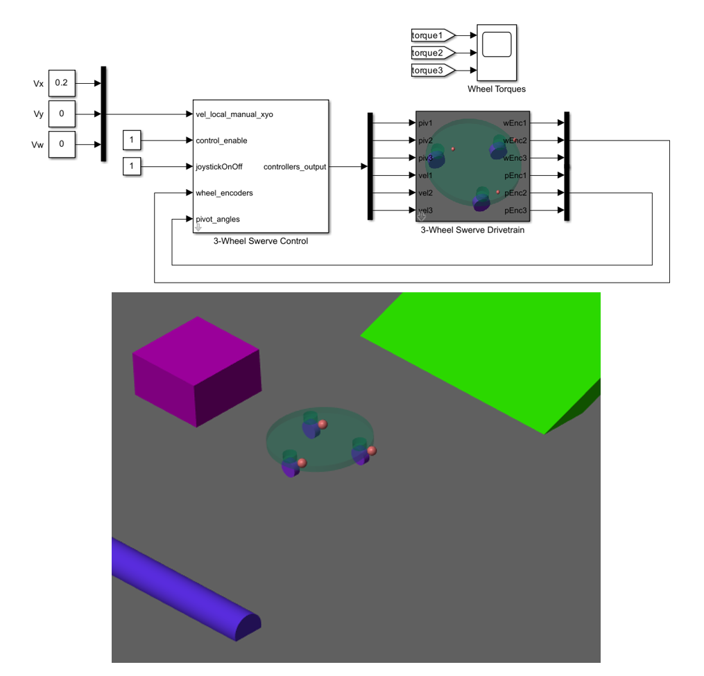

# Developing Swerve Robot Drivetrains
  

This GitHub repo contains Simulink&reg; models for the design and development of robot swerve drivetrains. Use these models to simulate different drivetrain configurations under different environmental parameters, derive motor specifications, test maximum pushing forces, and evaluate control algorithms for autonomous and remote-controlled applications.

## Models available:

1. 3WD and 4WD Generic Simulation and Control
2. 3WD Grip Test with Obstacles
3. 3WD Joystick Control for Driver Testing

## Further Learning and Development

* [Automatically generate code from Simulink&reg; models](https://www.mathworks.com/videos/series/student-competition-code-generation-training.html)
* [Creating Virtual Environments for Robots](https://blogs.mathworks.com/student-lounge/2020/08/18/creating-virtual-robot-environments-in-simscape-part-1/)
* [Mobile Robotics Tutorials](https://www.mathworks.com/videos/series/student-competition-mobile-robotics-training.html)
* [Autonomous Navigation for Mobile Robots Examples](https://www.mathworks.com/matlabcentral/fileexchange/95998-autonomous-navigation-for-mobile-robots-and-ugv?s_tid=srchtitle)

## MathWorks Products
- MATLAB&reg;
- Simuilnk&reg;
- Simscape&trade; Multibody&trade;
- Signal Processing Toolbox&trade;

## Community Support
Email: roboticsarena@mathworks.com

[MATLAB Central](https://www.mathworks.com/matlabcentral)

Copyright 2022 The MathWorks, Inc.

